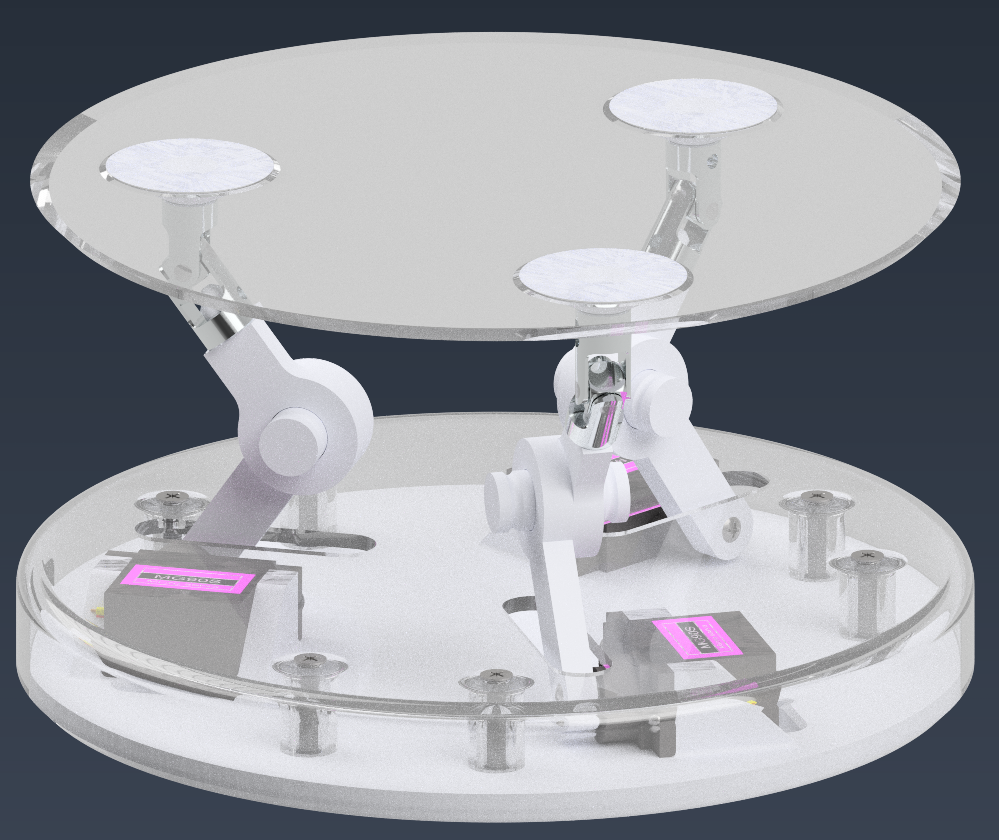

<h1 
    style="text-align:left; 
           font-family:Helvetica;
           font-weight: 1000">
    Ball Balancing 3RRS Parallel Platform Manipulator
</h1>

<h1 
    style="text-align:left; 
           font-family:Helvetica;
           font-weight: 1000">
    Project Description
</h1>

    This project is an attempt to replicate a video I saw over 5 years ago in high school of a ball balancing robot. After several failed attempts and years of redesign I landed on the current design.

    

This project is an attempt to replicate a video I saw over 5 years ago in high school of a ball balancing robot. After several failed attempts and years of redesign I landed on the current design.
<ul> 
    <li> Computer Vision             </li> 
    <li> Robotics                    </li>
    <li> Embedded Systems            </li>
    <li> Digital Control Systems     </li>
    <li> State Estimation            </li>
</ul>

<!-- https://youtu.be/57DbEEBF7sE?si=i6w106zvj4dvtrUl
https://www.ba-bot.com/ -->

    

