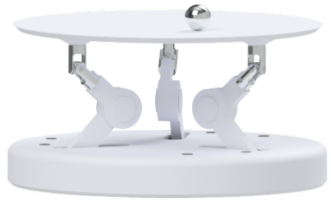

<h1 
    style="text-align:left; 
           font-family:Helvetica;
           font-weight: 1000">
    Ball Balancing 3RRS Parallel Platform Manipulator
</h1>

<h1 
    style="text-align:left; 
           font-family:Helvetica;
           font-weight: 1000">
    Project Description
</h1>

    This project is an attempt to replicate a video I saw over 5 years ago in high school of a ball balancing robot. After several failed attempts and years of redesign I landed on the current design.

    

Throughout the years of this project I only had one question, how do you get a machine to balance a ball? The thing I didn't know at the time was that the answer wasn't one singular thing, but rather a system that senses, thinks and acts. This project got me to learn several new things, namely:

<ul> 
    <li> <b>Computer Vision:         </b>Utilized OpenCV to estimate objects's position and velocity.     </li> 
    <li> <b>Robotics:                </b>Derived nverse kinematics for a 3RRS parallel manipulator.     </li>
    <li> <b>Embedded Systems:        </b>Sent actuator angles to ARM processor via UART communication.     </li>
    <li> <b>Digital Control Systems: </b>Implemented a discrete PID controller to control the position of the ball.     </li>
    <li> <b>State Estimation:        </b>Integrated a Kalman Filter to improve object tracking.   </li>
</ul>

<!-- https://youtu.be/57DbEEBF7sE?si=i6w106zvj4dvtrUl
https://www.ba-bot.com/ -->

    

